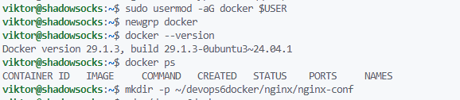
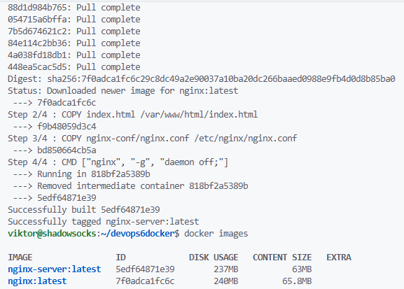
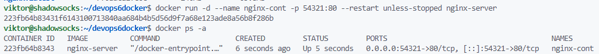
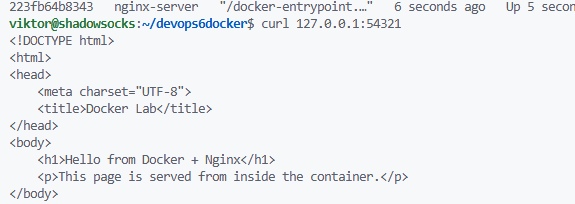
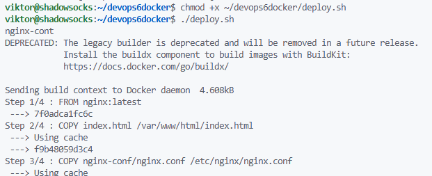

Структура лабораторной будет следующей
```
~/devops6docker/
├── deploy.sh
└── nginx/
    ├── Dockerfile
    ├── index.html
    └── nginx-conf/
        └── nginx.conf
```
Устанавливаем Docker
```
sudo apt update
sudo apt install -y docker.io
sudo usermod -aG docker $USER
newgrp docker
```
Проверяем
```
docker --version
docker ps
```


Создаем каталог под лабораторную
```
mkdir -p ~/devops6docker/nginx/nginx-conf
cd ~/devops6docker
```
Создаем `~/devops6docker/nginx/index.html`
```
<!DOCTYPE html>
<html>
<head>
    <meta charset="UTF-8">
    <title>Docker Lab</title>
</head>
<body>
    <h1>Hello from Docker + Nginx</h1>
    <p>This page is served from inside the container.</p>
</body>
</html>
```

Создаем `~/devops6docker/nginx/nginx-conf/nginx.conf`
```
events {}

http {
    server {
        listen 80;
        server_name localhost;

        root /var/www/html;
        index index.html;

        location / {
            try_files $uri $uri/ =404;
        }
    }
}
```

Создаем `~/devops6docker/nginx/Dockerfile`
```
FROM nginx:latest

COPY index.html /var/www/html/index.html
COPY nginx-conf/nginx.conf /etc/nginx/nginx.conf

CMD ["nginx", "-g", "daemon off;"]
```

Собираем образ
```
docker build -t nginx-server ./nginx
```

Проверяем
```
docker images
```


Запускаем контейнер
```
docker run -d --name nginx-cont -p 54321:80 --restart unless-stopped nginx-server
```

Проверяем
```
docker ps -a
```


Проверяем, что все работает
```
curl 127.0.0.1:54321
```


Оформляем запуск контейнера shell-скриптом.
Создаем файл `~/devops6docker/deploy.sh`
```
#!/bin/bash
set -e

docker rm -f nginx-cont 2>/dev/null || true

docker build -t nginx-server ./nginx

docker run -d \
  --name nginx-cont \
  -p 54321:80 \
  --restart unless-stopped \
  nginx-server

docker ps -a
curl 127.0.0.1:54321
docker logs -n 10 nginx-cont
```

Делаем исполняемым
```
chmod +x ~/devops6docker/deploy.sh
```

Запуск
```
cd ~/devops6docker
./deploy.sh
```

